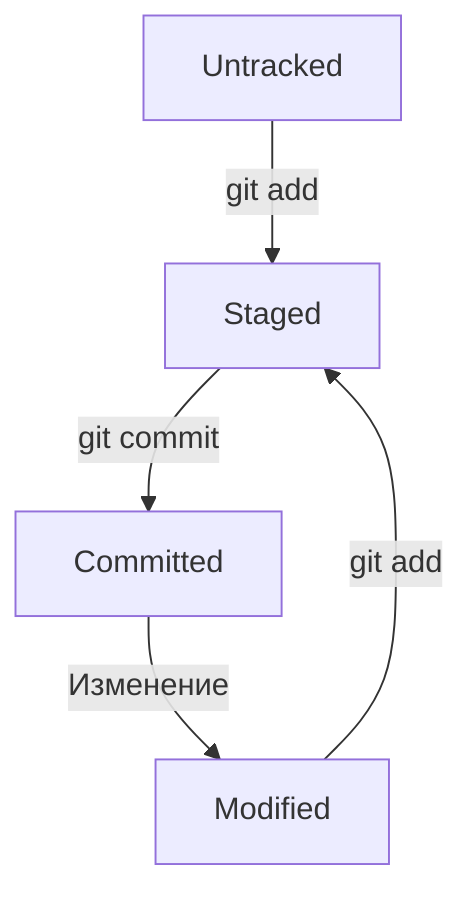

# Всевозможные шпаргалки
---
## Шпаргалка по Markdown

([https://github.com/sandino/Markdown-Cheatsheet](https://github.com/sandino/Markdown-Cheatsheet))
(перевод, [оригинал](https://github.com/adam-p/markdown-here/wiki/Markdown-Cheatsheet))

Поиграть с разметкой Markdown можно на [демо-странице](http://www.markdown-here.com/livedemo.html).

##### Содержание  
[Заголовки](#headers)  
[Выделение](#emphasis)  
[Списки](#lists)  
[Ссылки](#links)  
[Изображения](#images)  
[Подсветка кода и синтаксиса](#code)  
[Таблицы](#tables)  
[Цитаты](#blockquotes)  
[Встроенный HTML](#html)  
[Горизонтальная линия](#hr)  
[Новая строка](#lines)  
[Видео Youtube](#videos)  

<a name="headers"><h2>Заголовки</h2></a>

```no-highlight
# H1
## H2
### H3
#### H4
##### H5
###### H6

Кроме того, H1 и H2 можно обозначить подчеркиванием:

Alt-H1
======

Alt-H2
------
```

# H1
## H2
### H3
#### H4
##### H5
###### H6

Кроме того, заголовки H1 и H2 можно обозначить подчеркиванием:

Alt-H1
======

Alt-H2
------

<a name="emphasis"><h2>Выделение</h2></a>

```no-highlight
Курсив обозначается *звездочками* или _подчеркиванием_.

Полужирный шрифт - двойными **звездочками** или __подчеркиванием__.

Комбинированное выделение **звездочками и _подчеркиванием_**.

Для зачеркнутого текста используются две тильды . ~~Уберите это.~~
```

Курсив обозначается *звездочками* или _подчеркиванием_.

Полужирный шрифт - двойными **звездочками** или __подчеркиванием__.

Комбинированное выделение **звездочками и _подчеркиванием_**.

Для зачеркнутого текста используются две тильды . ~~Уберите это.~~


<a name="lists"><h2>Списки</h2></a>

(В данном примере предшествующие и завершающие пробелы обозначены точками: ⋅)

```no-highlight
1. Первый пункт нумерованного списка
2. Второй пункт
⋅⋅*Ненумерованный вложенный список.
1. Сами числа не имеют значения, лишь бы это были цифры
⋅⋅1. Нумерованный вложенный список
4. И еще один пункт.

⋅⋅⋅Внутри пунктов списка можно вставить абзацы с таким же отступом. Обратите внимание на пустую строку выше и на пробелы в начале (нужен по меньшей мере один, но здесь мы добавили три, чтобы также выровнять необработанный Markdown).

⋅⋅⋅Чтобы вставить разрыв строки, но не начинать новый параграф, нужно добавить два пробела перед новой строкой.⋅⋅
⋅⋅⋅Этот текст начинается с новой строки, но находится в том же абзаце.⋅⋅
⋅⋅⋅(В некоторых обработчиках, например на Github, пробелы в начале новой строки не нужны.)

* Ненумерованный список можно размечать звездочками
- Или минусами
+ Или плюсами
```

1. Первый пункт нумерованного списка
2. Второй пункт
  * Ненумерованный вложенный список.
1. Сами числа не имеют значения, лишь бы это были цифры
  1. Нумерованный вложенный список
4. И еще один пункт.

   Внутри пунктов списка можно вставить абзацы с таким же отступом. Обратите внимание на пустую строку выше и на пробелы в начале (нужен по меньшей мере один, но здесь мы добавили три, чтобы также выровнять необработанный Markdown).

   Чтобы вставить разрыв строки, но не начинать новый параграф, нужно добавить два пробела перед новой строкой.
   Эта текст начинается с новой строки, но находится в том же абзаце.
   (В некоторых обработчиках, например на Github, пробелы в начале новой строки не нужны.)

* Ненумерованный список можно размечать звездочками
- Или минусами
+ Или плюсами

<a name="links"><h2>Ссылки</h2></a>

Ссылки можно оформить разными способами.

```no-highlight
[Обычная ссылка в строке](https://www.google.com)

[Обычная ссылка с title](https://www.google.com "Сайт Google")

[Ссылка со сноской][Произвольный регистронезависимый текст]

[Относительная ссылка на документ](../blob/master/LICENSE)

[Для ссылок со сноской можно использовать цифры][1]

Или можно просто вставить ссылку в квадратные скобки [текст ссылки]

Произвольный текст, после которого можно привести ссылки.

[произвольный регистронезависимый текст]: https://www.mozilla.org
[1]: http://slashdot.org
[текст ссылки]: http://www.reddit.com
```

[Обычная ссылка в строке](https://www.google.com)

[Обычная ссылка с title](https://www.google.com "Сайт Google")

[Ссылка со сноской][Произвольный регистронезависимый текст] *

[Относительная ссылка на документ](../blob/master/LICENSE)

[Для ссылок со сноской можно использовать цифры][1]

Или можно просто вставить ссылку в квадратные скобки [текст ссылки]

Произвольный текст, после которого можно привести ссылки.

[Произвольный регистронезависимый текст]: https://www.mozilla.org
[1]: http://slashdot.org
[текст ссылки]: http://www.reddit.com

(*) Для символов не входящих в ASCII, например кириллицы, текст сноски все-таки регистрозависим (прим. перев.)

<a name="images"><h2>Изображения</h2></a>

```no-highlight
Вот наш логотип (наведите указатель, чтобы увидеть текст заголовка):

Внутри строки:  


В сноске:  
![alt-текст][logo]

[logo]: https://github.com/adam-p/markdown-here/raw/master/src/common/images/icon48.png "Текст заголовка логотипа 2"
```

Вот наш логотип (наведите указатель, чтобы увидеть текст заголовка):

Внутри строки:  


В сноске:  
![alt-текст][logo]

[logo]: https://github.com/adam-p/markdown-here/raw/master/src/common/images/icon48.png "Текст заголовка логотипа 2"

<a name="code"><h2>Код и подсветка синтаксиса</h2></a>

Блоки кода являются частью функций Markdown, но не подсветка синтаксиса. Однако многие обработчики, например Github или *Markdown Here*, поддерживают подсветку синтаксиса. Список поддерживаемых языков и способ их указания может различаться. *Markdown Here* поддерживает десятки языков (и не-языков, например синтаксис diff и заголовки HTTP); полный список и способ указания языков см. на странице [highlight.js demo-странице](http://softwaremaniacs.org/media/soft/highlight/test.html).

```no-highlight
`Код` в строке обрамляется `обратными апострофами`.
```

`Код` в строке обрамляется `обратными апострофами`.

Блоки кода выделяются либо тремя обратными апострофами <code>```</code> либо четырьмя пробелами в каждой строке. Рекомендуется использовать три апострофа -- они проще и только они поддерживают подсветку синтаксиса.

<pre lang="no-highlight"><code>```javascript
var s = "Подсветка JavaScript";
alert(s);
```
 
```python
s = "Подсветка Python"
print s
```
 
```
Язык не указан, синтаксис не подсвечен.
Но мы вставим в него &lt;b&gt;тег&lt;/b&gt;.
```
</code></pre>


```javascript
var s = "Подсветка JavaScript";
alert(s);
```
 
```python
s = "Подсветка Python"
print s
```

```
Язык не указан, синтаксис не подсвечен (некоторые обработчики все же подсвечивают).
Но мы вставим в него <b>тег</b>.
```


<a name="tables"><h2>Таблицы</h2></a>

Таблицы не являются частью Markdown, но многие обработчики, например *Markdown Here* и Github, поддерживают их. Они позволяют легко добавить таблицы в электронное письмо -- в других случаях для этого нужно копировать их из другого приложения.

```no-highlight
Вертикальные линии обозначают столбцы.

| Таблицы       | Это                | Круто |
| ------------- |:------------------:| -----:|
| столбец 3     | выровнен вправо    | $1600 |
| столбец 2     | выровнен по центру |   $12 |
| зебра-строки  | прикольные         |    $1 |

Внешние вертикальные линии (|) не обязательны, и они нужны только чтобы сам код Markdown выглядел красиво. Тот же код можно записать так:

Markdown | не такой | красивый
--- | --- | ---
*Но выводится* | `так же` | **клево**
1 | 2 | 3
```

Вертикальные линии обозначают столбцы.

| Таблицы       | Это                | Круто |
| ------------- |:------------------:| -----:|
| столбец 3     | выровнен вправо    | $1600 |
| столбец 2     | выровнен по центру |   $12 |
| зебра-строки  | прикольные         |    $1 |

Внешние вертикальные линии (|) не обязательны, и они нужны только чтобы сам код Markdown выглядел красиво. Тот же код можно записать так:

Markdown | не такой | красивый
--- | --- | ---
*Но выводится* | `так же` | **клево**
1 | 2 | 3

<a name="blockquotes"><h2>Цитаты</h2></a>

```no-highlight
> С помощью цитат очень удобно в письме обозначать исходный текст.
> Эта строка - часть той же цитаты.

Разрыв цитаты.

> Это очень длинная строка, но она будет правильно процитирована даже при размещении на нескольких строках. Продолжаем писать, чтобы эта строка не вмещалась на одной строке в любом окне. Кстати, в цитаты можно *вставлять* даже **Markdown**.
```

> С помощью цитат очень удобно в письме обозначать исходный текст.
> Эта строка - часть той же цитаты.

Разрыв цитаты.

> Это очень длинная строка, но она будет правильно процитирована даже при размещении на нескольких строках. Продолжаем писать, чтобы эта строка не вмещалась на одной строке в любом окне. Кстати, в цитаты можно также *размечать* с помощью **Markdown**.

<a name="html"><h2>Встроенный HTML</h2></a>

Часто Markdown понимает чистый HTML.

```no-highlight
<dl>
  <dt>Список определений</dt>
  <dd>Это то, что люди иногда используют.</dd>

  <dt>Markdown внутри HTML</dt>
  <dd>Работает *не очень** хорошо. Используйте HTML-<em>теги</em>.</dd>
</dl>
```

<dl>
  <dt>Список определений</dt>
  <dd>Это то, что люди иногда используют.</dd>

  <dt>Markdown внутри HTML</dt>
  <dd>Работает *не очень** хорошо. Используйте HTML-<em>теги</em>.</dd>
</dl>

<a name="hr"><h2>Горизонтальные линии</h2></a>

```
Три и более...

---

Дефисы

***

Звездочки

___

Подчеркивания
```

Три и более...

---

Дефисы

***

Звездочки

___

Подчеркивания

<a name="lines"><h2>Новая строка</h2></a>

Для понимания работы разрыва строка автор главным образом рекомендует экспериментировать и пробовать -- нажмите &lt;Enter&gt; один раз (т.е. перейдите на новую строку), потом нажмите дважды (т.е. вставьте две новые строки) и посмотрите что приозошло. Вы сразу поймете что вам нужно. В расширении [Markdown Here](https://github.com/adam-p/markdown-here) для браузеров есть удобная функция "Markdown Toggle", которая поможет в этом.

*Примечание переводчика:*  
*Для переноса на новую строку в конце предыдущей строки необходимо добавить* **два пробела**. *Без этого большинство парсеров Markdown не выполняют переход на новую строку.*

Попробуйте ввести следующее:

```
Это начальная строка

Эта строка отделена от предыдущей двумя новыми строками и станет *отдельным абзацем*.

Это тоже отдельный абзац, но...⋅⋅
Эта строка отделена одной новой строкой, поэтому она находится в *том же абзаце*.
```

Это начальная строка

Эта строка отделена от предыдущей двумя новыми строками и станет *отдельным абзацем*.

Это тоже отдельный абзац, но...`[здесь два пробела]`  
Эта строка отделена одной новой строкой, поэтому она находится в *том же абзаце*.  

(Примечание: В [Markdown Here](https://github.com/adam-p/markdown-here) разрывы строк ведут себя так же, как в [GFM](https://help.github.com/articles/github-flavored-markdown), поэтому не нужно вставлять по две новые строки.)

<a name="videos"><h2>Видео Youtube</h2></a>

Ролики нельзя вставить напрямую, но можно вставить изображение со ссылкой на видео, например:

```no-highlight
<a href="http://www.youtube.com/watch?feature=player_embedded&v=ID_ВИДЕОРОЛИКА_НА_YOUTUBE" target="_blank"></a>
```

На чистом Markdown, но без размеров изображения и рамки:

```no-highlight
[](http://www.youtube.com/watch?v=ID_ВИДЕОРОЛИКА_НА_YOUTUBE)
```
---------------------
## Шпаргалка по Git в целом

### Основные понятия

#### Хеш (Hash)
Хеш — это уникальный идентификатор коммита, который генерируется Git на основе содержимого коммита. Он используется для идентификации конкретного состояния репозитория.

#### Лог (Log)
Команда `git log` отображает историю коммитов в репозитории. Вы можете увидеть хеши коммитов, авторов, даты и сообщения к коммитам.

#### HEAD
HEAD — это указатель на текущий коммит, на котором вы находитесь. Обычно он указывает на последний коммит в активной ветке.

#### Оформление сообщений к коммитам
Сообщения к коммитам должны быть информативными и краткими. Рекомендуется следовать этим правилам:

Для сообщений на русском языке часто рекомендуют использовать инфинитивы. Например: `Добавить тесты для PipkaService`, `Исправить ошибку #123` и так далее.
Для сообщений на английском рекомендуется использовать повелительное наклонение (англ. imperative). Например: `Use library mega_lib_300`, `Fix exit button` и так далее.
Эти рекомендации сложились исторически, и им следуют многие проекты.


### Статусы и жизненный цикл файлов в Git

Файлы в Git могут находиться в одном из нескольких состояний:

- Untracked: файл существует в рабочем каталоге, но не добавлен в систему отслеживания Git.
- Modified: файл был изменен после последнего коммита.
- Staged: файл был подготовлен для коммита (добавлен в индекс).
- Committed: изменения зафиксированы в репозитории.

#### Схема изменения статусов файлов



### Основные команды
#### Инициализация репозитория
`git init` (от англ. initialize, «инициализировать») — инициализируй репозиторий.

#### Синхронизация локального и удалённого репозиториев
`git remote add origin https://github.com/solidus66/first-project-yandex-pract`  (от англ. remote, «удалённый» + add, «добавить») — привяжи локальный репозиторий к удалённому с URL `https://github.com/solidus66/first-project-yandex-pract`;

`git remote -v` (от англ. verbose, «подробный») — проверь, что репозитории действительно связались;

`git push -u origin main` (от англ. push, «толкать») — в первый раз загрузи все коммиты из локального репозитория в удалённый с названием `origin`. Ветка может называться `master`, а не `main`.

`git push` (от англ. push, «толкать») — загрузи коммиты в удалённый репозиторий после того, как он был привязан с помощью флага `-u`.

#### Подготовка файла к коммиту
`git add todo.txt` (от англ. add, «добавить») — подготовь файл `todo.txt` к коммиту;

`git add --all` (от англ. add, «добавить» + all, «всё») — подготовь к коммиту сразу все файлы, в которых были изменения, и все новые файлы;

`git add .` — подготовь к коммиту текущую папку и все файлы в ней.

#### Создание и публикация коммита
`git commit -m "Комментарий к коммиту."` (от англ. commit, «совершать», фиксировать» + message, «сообщение») — сделай коммит и оставь комментарий, чтобы было проще понять, какие изменения сделаны;

`git push` (от англ. push, «толкать») — добавь изменения в удалённый репозиторий.

#### Просмотр информации о коммитах
`git log` (от англ. log, «журнал [записей]») — выведи подробную историю коммитов;

`git log --oneline` (от англ. log, «журнал [записей]» + oneline, «одной строкой») — покажи краткую информацию о коммитах: сокращённый хеш и сообщение.

#### Просмотр состояния файлов
`git status` (от англ. status, «статус», «состояние») — покажи текущее состояние репозитория.

#### Добавление изменений в последний коммит
`git commit --amend --no-edit` (от англ. amend, «исправить») — добавь изменения к последнему коммиту и оставь сообщение прежним;

`git commit --amend -m "Новое сообщение"` — измени сообщение к последнему коммиту на `Новое сообщение`.

#### «Откат» файлов и коммитов
`git restore --staged hello.txt` (от англ. restore, «восстановить») — переведи файл `hello.txt` из состояния `staged` обратно в `untracked` или `modified`;

`git restore hello.txt` — верни файл `hello.txt` к последней версии, которая была сохранена через `git commit` или `git add`;

`git reset --hard b576d89` (от англ. reset, «сброс», «обнуление» + hard, «суровый») — удали все незакоммиченные изменения из staging и «рабочей зоны» вплоть до указанного коммита.

#### Просмотр изменений
`git diff` (от англ. difference, «отличие», «разница») — покажи изменения в «рабочей зоне», то есть в `modified`-файлах;

`git diff a9928ab 11bada1` — выведи разницу между двумя коммитами;

`git diff --staged` — покажи изменения, которые добавлены в `staged`-файлах.