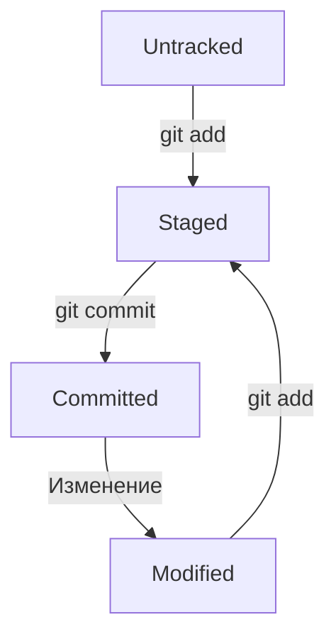

## Шпаргалка по Git
## Основные понятия
### Хеш (Hash)
Хеш — это уникальный идентификатор коммита, который генерируется Git на основе содержимого коммита. Он используется для идентификации конкретного состояния репозитория.

### Лог (Log)
Команда `git log` отображает историю коммитов в репозитории. Вы можете увидеть хеши коммитов, авторов, даты и сообщения к коммитам.

### HEAD
HEAD — это указатель на текущий коммит, на котором вы находитесь. Обычно он указывает на последний коммит в активной ветке.

### Оформление сообщений к коммитам
Сообщения к коммитам должны быть информативными и краткими. Рекомендуется следовать этим правилам:

Для сообщений на русском языке часто рекомендуют использовать инфинитивы. Например: `Добавить тесты для PipkaService`, `Исправить ошибку #123` и так далее.
Для сообщений на английском рекомендуется использовать повелительное наклонение (англ. imperative). Например: `Use library mega_lib_300`, `Fix exit button` и так далее.
Эти рекомендации сложились исторически, и им следуют многие проекты.

## Статусы и жизненный цикл файлов в Git

Файлы в Git могут находиться в одном из нескольких состояний:

- Untracked: файл существует в рабочем каталоге, но не добавлен в систему отслеживания Git.
- Modified: файл был изменен после последнего коммита.
- Staged: файл был подготовлен для коммита (добавлен в индекс).
- Committed: изменения зафиксированы в репозитории.

### Схема изменения статусов файлов

---
## Основные команды
### Инициализация репозитория
`git init` (от англ. initialize, «инициализировать») — инициализируй репозиторий.

### Синхронизация локального и удалённого репозиториев
`git remote add origin https://github.com/solidus66/first-project-yandex-pract`  (от англ. remote, «удалённый» + add, «добавить») — привяжи локальный репозиторий к удалённому с URL `https://github.com/solidus66/first-project-yandex-pract`;

`git remote -v` (от англ. verbose, «подробный») — проверь, что репозитории действительно связались;

`git push -u origin main` (от англ. push, «толкать») — в первый раз загрузи все коммиты из локального репозитория в удалённый с названием `origin`. Ветка может называться `master`, а не `main`.

`git push` (от англ. push, «толкать») — загрузи коммиты в удалённый репозиторий после того, как он был привязан с помощью флага `-u`.

### Подготовка файла к коммиту
`git add todo.txt` (от англ. add, «добавить») — подготовь файл `todo.txt` к коммиту;

`git add --all` (от англ. add, «добавить» + all, «всё») — подготовь к коммиту сразу все файлы, в которых были изменения, и все новые файлы;

`git add .` — подготовь к коммиту текущую папку и все файлы в ней.

### Создание и публикация коммита
`git commit -m "Комментарий к коммиту."` (от англ. commit, «совершать», фиксировать» + message, «сообщение») — сделай коммит и оставь комментарий, чтобы было проще понять, какие изменения сделаны;

`git push` (от англ. push, «толкать») — добавь изменения в удалённый репозиторий.

### Просмотр информации о коммитах
`git log` (от англ. log, «журнал [записей]») — выведи подробную историю коммитов;

`git log --oneline` (от англ. log, «журнал [записей]» + oneline, «одной строкой») — покажи краткую информацию о коммитах: сокращённый хеш и сообщение.

### Просмотр состояния файлов
`git status` (от англ. status, «статус», «состояние») — покажи текущее состояние репозитория.

### Добавление изменений в последний коммит
`git commit --amend --no-edit` (от англ. amend, «исправить») — добавь изменения к последнему коммиту и оставь сообщение прежним;

`git commit --amend -m "Новое сообщение"` — измени сообщение к последнему коммиту на `Новое сообщение`.

### «Откат» файлов и коммитов
`git restore --staged hello.txt` (от англ. restore, «восстановить») — переведи файл `hello.txt` из состояния `staged` обратно в `untracked` или `modified`;

`git restore hello.txt` — верни файл `hello.txt` к последней версии, которая была сохранена через `git commit` или `git add`;

`git reset --hard b576d89` (от англ. reset, «сброс», «обнуление» + hard, «суровый») — удали все незакоммиченные изменения из staging и «рабочей зоны» вплоть до указанного коммита.

### Просмотр изменений
`git diff` (от англ. difference, «отличие», «разница») — покажи изменения в «рабочей зоне», то есть в `modified`-файлах;

`git diff a9928ab 11bada1` — выведи разницу между двумя коммитами;

`git diff --staged` — покажи изменения, которые добавлены в `staged`-файлах.