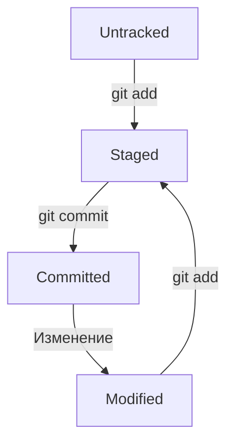

## Шпаргалка по Git
## Основные понятия
### Хеш (Hash)
Хеш — это уникальный идентификатор коммита, который генерируется Git на основе содержимого коммита. Он используется для идентификации конкретного состояния репозитория.

### Лог (Log)
Команда `git log` отображает историю коммитов в репозитории. Вы можете увидеть хеши коммитов, авторов, даты и сообщения к коммитам.

### HEAD
HEAD — это указатель на текущий коммит, на котором вы находитесь. Обычно он указывает на последний коммит в активной ветке.

### Оформление сообщений к коммитам
Сообщения к коммитам должны быть информативными и краткими. Рекомендуется следовать этим правилам:

Для сообщений на русском языке часто рекомендуют использовать инфинитивы. Например: `Добавить тесты для PipkaService`, `Исправить ошибку #123` и так далее.
Для сообщений на английском рекомендуется использовать повелительное наклонение (англ. imperative). Например: `Use library mega_lib_300`, `Fix exit button` и так далее.
Эти рекомендации сложились исторически, и им следуют многие проекты.

## Статусы и жизненный цикл файлов в Git

Файлы в Git могут находиться в одном из нескольких состояний:

- Untracked: файл существует в рабочем каталоге, но не добавлен в систему отслеживания Git.
- Modified: файл был изменен после последнего коммита.
- Staged: файл был подготовлен для коммита (добавлен в индекс).
- Committed: изменения зафиксированы в репозитории.

### Схема изменения статусов файлов


---
## Основные команды
### Инициализация репозитория
`git init` (от англ. initialize, «инициализировать») — инициализируй репозиторий.

### Синхронизация локального и удалённого репозиториев
`git remote add origin https://github.com/solidus66/first-project-yandex-pract`  (от англ. remote, «удалённый» + add, «добавить») — привяжи локальный репозиторий к удалённому с URL `https://github.com/solidus66/first-project-yandex-pract`;

`git remote -v` (от англ. verbose, «подробный») — проверь, что репозитории действительно связались;

`git push -u origin main` (от англ. push, «толкать») — в первый раз загрузи все коммиты из локального репозитория в удалённый с названием `origin`. Ветка может называться `master`, а не `main`.

`git push` (от англ. push, «толкать») — загрузи коммиты в удалённый репозиторий после того, как он был привязан с помощью флага `-u`.

### Подготовка файла к коммиту
`git add todo.txt` (от англ. add, «добавить») — подготовь файл `todo.txt` к коммиту;

`git add --all` (от англ. add, «добавить» + all, «всё») — подготовь к коммиту сразу все файлы, в которых были изменения, и все новые файлы;

`git add .` — подготовь к коммиту текущую папку и все файлы в ней.

### Создание и публикация коммита
`git commit -m "Комментарий к коммиту."` (от англ. commit, «совершать», фиксировать» + message, «сообщение») — сделай коммит и оставь комментарий, чтобы было проще понять, какие изменения сделаны;

`git push` (от англ. push, «толкать») — добавь изменения в удалённый репозиторий.

### Просмотр информации о коммитах
`git log` (от англ. log, «журнал [записей]») — выведи подробную историю коммитов;

`git log --oneline` (от англ. log, «журнал [записей]» + oneline, «одной строкой») — покажи краткую информацию о коммитах: сокращённый хеш и сообщение.

### Просмотр состояния файлов
`git status` (от англ. status, «статус», «состояние») — покажи текущее состояние репозитория.

### Добавление изменений в последний коммит
`git commit --amend --no-edit` (от англ. amend, «исправить») — добавь изменения к последнему коммиту и оставь сообщение прежним;

`git commit --amend -m "Новое сообщение"` — измени сообщение к последнему коммиту на `Новое сообщение`.

### «Откат» файлов и коммитов
`git restore --staged hello.txt` (от англ. restore, «восстановить») — переведи файл `hello.txt` из состояния `staged` обратно в `untracked` или `modified`;

`git restore hello.txt` — верни файл `hello.txt` к последней версии, которая была сохранена через `git commit` или `git add`;

`git reset --hard b576d89` (от англ. reset, «сброс», «обнуление» + hard, «суровый») — удали все незакоммиченные изменения из staging и «рабочей зоны» вплоть до указанного коммита.

`git rm -r --cached File/FolderName` — удали файл или папку из индекса (staging area), но оставь их в рабочем каталоге. Полезно для удаления файлов из отслеживания Git и репозитория Github, сохраняя их локально.

### Просмотр изменений
`git diff` (от англ. difference, «отличие», «разница») — покажи изменения в «рабочей зоне», то есть в `modified`-файлах;

`git diff a9928ab 11bada1` — выведи разницу между двумя коммитами;

`git diff --staged` — покажи изменения, которые добавлены в `staged`-файлах.

---
## Работа с ветками
### Клонирование чужого репозитория
`git clone git@github.com:YandexPraktikum/first-project.git` (от англ. clone, «клон», «копия») — склонируй репозиторий с URL `first-project.git` из аккаунта `YandexPraktikum` на мой локальный компьютер.

### Создание веток
`git branch feature/the-finest-branch` (от англ. branch, «ветка») — создай ветку от текущей с названием `feature/the-finest-branch`;

`git checkout -b feature/the-finest-branch` — создай ветку `feature/the-finest-branch` и сразу переключись на неё.

### Навигация по веткам
`git branch` (от англ. branch, «ветка») — покажи, какие есть ветки в репозитории и в какой из них я нахожусь (текущая ветка будет отмечена символом `*`);

`git branch -a` — покажи все известные ветки, как локальные (в локальном репозитории), так и удалённые (в origin, или на GitHub).

`git checkout feature/br` — переключись на ветку `feature/br`.

### Сравнение веток
`git diff main HEAD` (от англ. difference, «отличие», «разница») — покажи разницу между веткой `main` и указателем на `HEAD`;

`git diff HEAD~2 HEAD` — покажи разницу между тем коммитом, который был два коммита назад, и текущим.

### Удаление веток
`git branch -d br-name` — удали ветку `br-name`, но только если она является частью `main`;

`git branch -D br-name` — удали ветку `br-name`, даже если она не объединена с `main`.

### Слияние веток
`git merge main` (от англ. merge, «сливать», «поглощать») — объедини ветку `main` с текущей активной веткой. 

### Работа с удалённым репозиторием
`git push -u origin my-branch` (от англ. push, «толкнуть», «протолкнуть») — отправь новую ветку `my-branch` в удалённый репозиторий и свяжи локальную ветку с удалённой, чтобы при дополнительных коммитах можно было писать просто `git push` без `-u`;

`git push my-branch` — отправь дополнительные изменения в ветку `my-branch`, которая уже существует в удалённом репозитории;

`git pull` (от англ. pull, «вытянуть») — подтяни изменения текущей ветки из удалённого репозитория.

Пример: 
```BASH
$ git checkout main # перешли в main
$ git pull # подтянули новые изменения в main
$ git checkout my-branch # вернулись в рабочую ветку my-branch
$ git merge main # влили main в новую ветку my-branch
$ git push -u origin my-branch # отправили ветку my-branch в удалённый репозиторий
```
---
## Командная работа в Git
### Feature branch workflow
Самый популярный подход к работе с Git в команде — это feature branch workflow. В нём создают ветку для каждой задачи (например, для новой функциональности или исправления бага), а когда всё готово, вливают новую ветку в `main`.  

Важные этапы этого процесса — пул-реквест и ревью изменений. Пул-реквест — это интерфейс, в котором можно обсудить изменения. Ревью — просмотр изменений другими участниками и один из способов проверить качество таких изменений.  

Если вы уже участник проекта (или collaborator в терминах GitHub), можно клонировать репозиторий напрямую. А если нет, нужно предварительно сделать «форк». Также для участников доступна кнопка Merge после ревью, а для неучастников — нет.  

### Конфликты слияния
Когда один и тот же файл меняется в нескольких ветках, при их слиянии может произойти конфликт. Пугаться конфликтов не нужно, это нормальная часть работы с системами контроля версий. IDE, вроде VSCode или Intellij IDEA, помогут «склеить» файл из двух конфликтующих версий.  

### Алгоритм-шпаргалка для создания PR
1. Склонировать репозиторий.  
    1.1. Если вы не участник проекта, предварительно сделать «форк» исходного репозитория.  
    1.2. На странице репозитория или «форка» нажать кнопки: Code → SSH → скопировать ссылку.  
    1.3. Выполнить команду `git clone <ссылка на репозиторий>`.  

2. Создать ветку для вашей задачи: `git checkout -b my-task-branch-name`.

3. Добавить и «закоммитить» изменения, которые вы хотите внести в проект.

4. «Запушить» ветку: `git push --set-upstream origin HEAD` или `git push -u origin my-task-branch-name`.  
    4.1. GitHub (с помощью Git) выведет ссылку на создание PR. По ней нужно перейти.  
    4.2. PR можно также создать через интерфейс GitHub.  

5. Сообщить о пул-реквесте ревьюеру.
    5.1. Иногда ревьюеры назначаются автоматически, тогда сообщать не нужно.

6. Обсуждать с ревьюером предлагаемые изменения и вносить правки, пока эти изменения не будут одобрены (пока не будет получен «апрув»).  
    6.1. Если кто-то добавил конфликтующие изменения в `main`, пока ваш PR был на ревью, нужно разрешить конфликт:  
            - Обновить `main`: `git checkout main && git pull`.  
            - Влить `main` в свою ветку: `git checkout my-task-branch-name && git merge main`.  
            - Разрешить конфликты слияния с помощью IDE или вручную.  
            - Создать коммит слияния: `git commit --no-edit` или `git commit -m 'merge main'`.  
            - Сделать `git push` своей ветки.  

7. Нажать кнопку Merge или подождать, пока её нажмёт кто-то ещё.

8. Ещё раз обновить `main`, чтобы «подтянуть» ваши изменения в основную ветку локального репозитория: `git checkout main && git pull`.

### Алгоритм-шпаргалка для разрешения конфликтов слияния
1. Открыть проект в IDE (VS Code, IDEA или другие).
2. Открыть файл, в котором есть конфликт.
3. Выбрать, какие части файла нужно взять из одной ветки, а какие — из другой.
4. Когда конфликты разрешены, сделать коммит: `git commit --no-edit` или `git commit -m 'merge branch <название ветки>'`.

